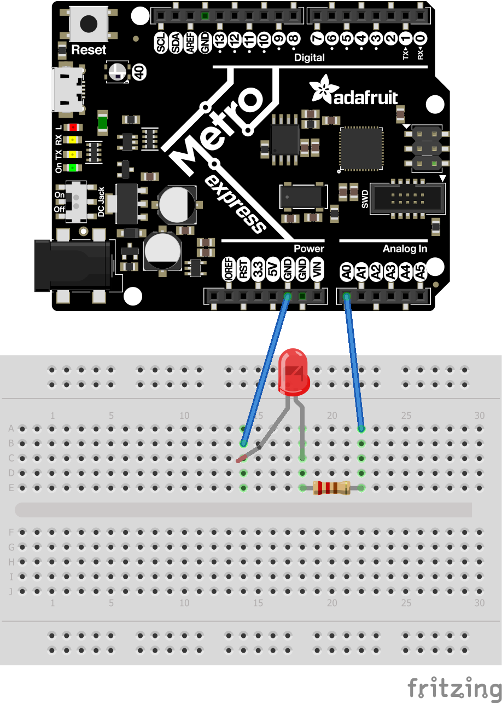
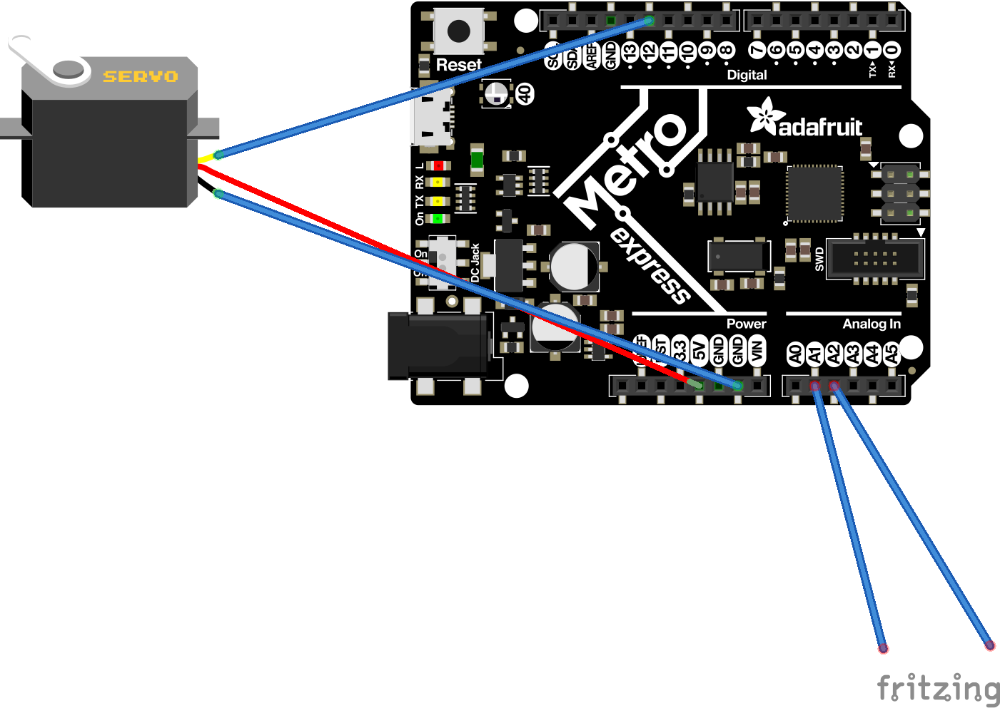
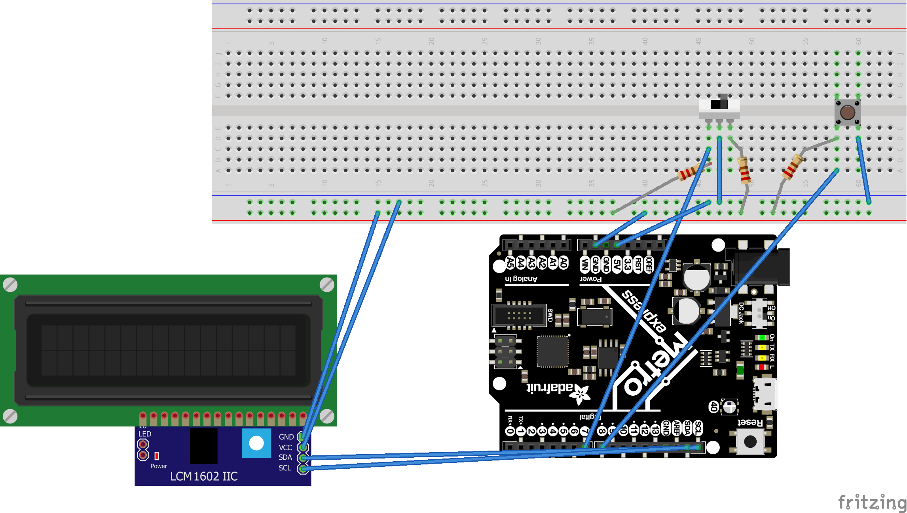
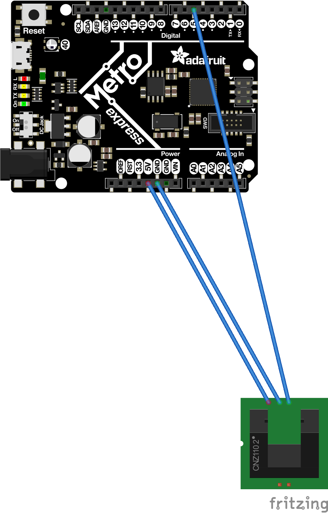

# CircuitPython
These are my circuit python assignments

## Hello CircuitPython

### Assignment
In this assignment I learned the basicsa of a new coding language. The Metro itself functions really similarly to an arduino. The metro has a cool little RGB LED that you can change the color of with code. The objective of this assignment was to get the built in LED to fade in and out. 

### Pictures 

## Lessons
I Learned the basics of a completely new coding language. Using commands like making a PWM object and duty cycle. I learned how to change the brightness of the LED. This assignment was a big learning curve because it was new to me. 

# CircuitPython Servo
In this assignment I used capacitive touch to make a servo turn. We have to get it so that there are two wires controlling the servo, when you touch the left wire the servo turns to the left, when you touch the right wire the servo turns to the right. 
## Pictures

## Lessons
Before this I had no clue what capacitive touch was and how to implement it into my engineering. Capacitive touch is when you complete the circuit by touching a wire. I also learned about duty cycle. Duty cycle is the amount of time that the pulses stay high.

# CircuitPython LCD

## Assignment 
In this assignment I used a 2 buttons and an LCD screen. One button switched the direction the numbers were counting. The other button just counted in the corresponding direction.

## Pictures

## Lessons 
In this assignment I learned how to control the direction of the numbers. This was similar to an assignment I did last year but using circuitpython instead of Arduino.

# PhotoInterrupter

## Assignment 
In this assignment we used a photointerrupter to count the number of interruptions in a 4 second span.

## Pictures

## Lessons
In this assignment I learned how to code a photointerrupter using circuitpython. I also learned how to use time.monotonic(0) instead of time.sleep.

# Distance Sensor

## Assignment
in this assignment we used a HC-SR04 to calculate distacne and have the distance correspond with a LED color.

## pictures
Insert Pictures

## Lesson
In this assignment I learned how to represent distance with a color of an LED. I also learned how to program an HC-SR04 on circuitpython.

# Classes Objects and Modules

## In this assignment we had to create a class and import it into our code that changed the color of an LED

## pictures

Insert pictures

# Lesson 
I learned how to use classes, object and modules. I also learned how importing classes works.

# hello VS code

## Code
import board
import time
import pulseio
from digitalio import DigitalInOut, Direction, Pull

class RGB:
    def __init__(self, r, g, b):
        self.r = DigitalInOut(r)
        self.r.direction = Direction.OUTPUT
        self.g = DigitalInOut(g)
        self.g.direction = Direction.OUTPUT
        self.b = DigitalInOut(b)
        self.b.direction = Direction.OUTPUT
    def red(self):
        self.r.value = False
        self.g.value = True
        self.b.value = True
    def green(self):
        self.g.value = False
        self.b.value = True
        self.r.value = True
    def blue(self):
        self.b.value = False
        self.g.value = True
        self.r.value = True
    def cyan(self):
        self.g.value = False
        self.b.value = False
        self.r.value = True
    def magenta(self):
        self.r.value = False
        self.b.value = False
        self.g.value = True
    def yellow(self):
        self.b.value = True
        self.g.value = False
        self.r.value = False

## Assignment
In this assignment we had to learn the basics of VS code and import it to our GitHub

## pictures 
insert Pictures

# Lesson
In this assignment we learned how to use vs code and push code from vs code to gihub.

